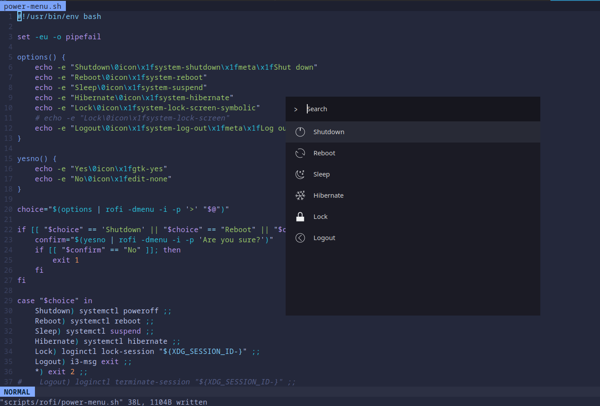

# Rofi

Rofi tips and tricks I've found

## Customising rows (icons, meta)

You can add icons and invisible search terms easily to your rows in Rofi.

See `man rofi-script` and the `Parsing row options` section for options you can customise on a row (snippet below):

Extra options for individual rows can be set.  The extra option can be specified following the same syntax as mode option, but following the entry.

For example:
* `echo -en "aap\0icon\x1ffolder\n"`

The following options are supported:
* `icon`: Set the icon for that row.
* `meta`: Specify invisible search terms.
* `nonselectable`: If true the row cannot activated.
* `info`: Info that, on selection, gets placed in the ROFI_INFO environment variable. This entry does not get searched.

Multiple entries can be passed using the \x1f separator:
* `echo -en "aap\0icon\x1ffolder\x1finfo\x1ftest\n"`

For a real example see:
* https://github.com/itsjfx/dotfiles/blob/master/scripts/rofi/power-menu.sh
    * 
* https://github.com/itsjfx/dotfiles/blob/master/scripts/rofi/firefox.sh

## Saving an application for search

See [saving-websites-as-apps](saving-websites-as-apps.md)