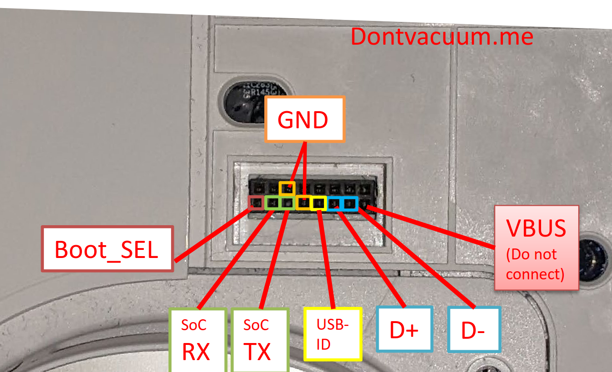
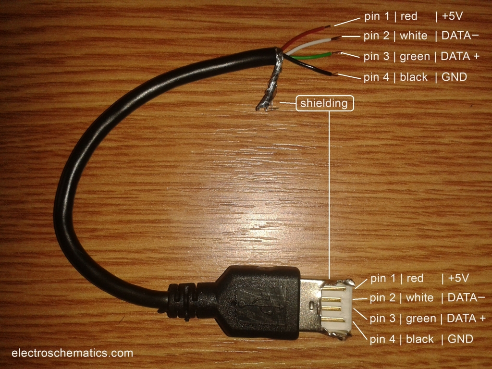

# Rooting a robot vacuum

See these resources:
* https://robotinfo.dev -- registry for which model to buy, and details on how to root the model
* https://builder.dontvacuum.me -- firmware builder
* https://builder.dontvacuum.me/dreame/faq.txt -- faq
* https://valetudo.cloud/pages/general/getting-started.html -- valetudo instructions
* root instructions (differs on your model, see below for dreame/roborock)
    * https://builder.dontvacuum.me/nextgen
    * https://builder.dontvacuum.me/nextgen/dreame_gen3.pdf (master PDF)
    * https://valetudo.cloud/pages/installation/dreame.html#fastboot (instructions for Valetudo)
* home assistant integration
    * setup MQTT with Valetudo and it'll automatically pick up your robot
        * https://valetudo.cloud/pages/integrations/home-assistant-integration.html
        * this will give home assistant visibility of your robot
    * to control the robot, add this card: https://github.com/PiotrMachowski/lovelace-xiaomi-vacuum-map-card
        * the best card for controlling your robot, like-for-like to the native application, if not better
        * you can customise pretty much anything (including zone placement on the map, icons, etc)
    * to get your map on the card, follow these steps:
        * https://github.com/PiotrMachowski/lovelace-xiaomi-vacuum-map-card/blob/master/docs/templates/hypferValetudo.md
        * install this plugin via HACS: https://github.com/sca075/valetudo_vacuum_camera
        * configure your `calibration_source` like below from the `README`
        * your robot should appear with the correct map

```yaml
type: custom:xiaomi-vacuum-map-card
entity: vacuum.valetudo_yourvacuum
vacuum_platform: Hypfer/Valetudo
map_source:
  camera: camera.valetudo_vacuum_camera 
calibration_source: 
  camera: true 
internal_variables: 
  topic: valetudo/your_topic  
```

## Notes for Dreame L10s Ultra rooting

TLDR: other than the USB 2.0 shenanigans mentioned earlier, it was pretty smooth... make sure you actually have a USB 2.0 port. Make sure you read the PDF completely and understand the steps.

* it went pretty well following the PDF: https://builder.dontvacuum.me/nextgen/dreame_gen3.pdf
    * make sure you follow the instructions in order clearly, and you read ahead
    * make sure you got the commands preprepared for when you use `fastboot`
        * there's a cheatsheet here with the commands you need: https://builder.dontvacuum.me/nextgen/fastboot-cheatcheat.txt
* you cannot do UART, so have to do USB with debug pins method
* it only grounded correctly if i grounded `BOOT_SEL` to the ground pin on the bottom row (4th one at the bottom)
    * 
    * you'll know if it's grounded correctly/in debug mode cause the robot lights will start flashing and no jingle/sound will play
* to get a usb 2.0 cable, i grabbed a old mouse, opened it up and pulled the USB cable out of the PCB plug
* suggest taping the 5v on the USB A (first pin) just in case the red wire is not the 5v one, so you don't fry anything
    * https://www.wikiwand.com/en/USB_hardware#Pinouts
    * 
    * https://www.electroschematics.com/usb-how-things-work/
* i did it on windows 11, with a USB 2.0 port
    * turns out a USB 2.0 port is super important
    * you will find that you cannot flash the `boot1` img later if it's over usb 3.0+
    * unfortunately i had no usb2.0 port... despite what the instructions say I tried using usb C hub which had a usb 2.0 port on it
    * after replugging the cable a bunch of times it let me flash `boot1` via theh ub
    * if you see: `FAILED (data write failure (Unknown error))` it's cause you need USB 2.0 for the flash
* if the device is not showing up in `fastboot` or being weird, you probably need to install the drivers mentioned in the PDF
* it looks like the robot will exit debug mode after a few mins after you disconnect the `BOOT_SEL` pin and flash the firmware, so you might need to reboot it a few times if you're slow. you want to reboot and run the `fastboot flash` commands as quickly as possible later on
* copy everything you run down in the terminal into notepad or somewhere safe
* backup important stuff, from faq txt file
```bash
'dd if=/dev/by-name/private | gzip -9 > /tmp/backup_private.dd.gz'
'dd if=/dev/by-name/misc | gzip -9 > /tmp/backup_misc.dd.gz'
```
* copy off via SCP or with the valetudo web server https://github.com/Hypfer/valetudo-helper-httpbridge
* don't lose your ssh credentials, write down the root password, or keep an ssh key